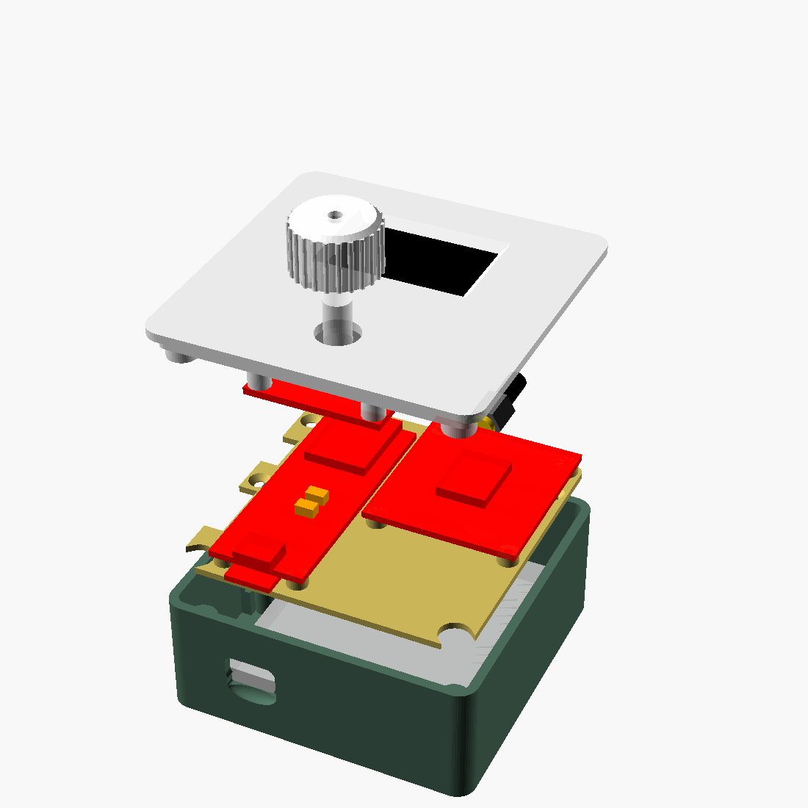

# open-gps: Golf Shot Tracker

A handheld, open-source golf shot tracker built from SparkFun Qwiic parts. Turn the dial to pick a club, click at the ball, walk to where it landed, click again, and it shows the distance in yards. Every shot is saved to flash and can be exported over USB as GeoJSON or CSV, with start and landing coordinates for each shot.



> [!TIP]
> **🛒 [Get every part in one click: SparkFun wishlist](https://www.sparkfun.com/wishlist/shared/index/code/GlRlCXNElCsNx5QNRKp5i46RxsmUJz3x/?affiliate_code=rfxlS0eYyY&referring_service=link)**: all the electronics on one list, ready to add to your cart.
> <sub>This is a referral link, so buying through it supports the project at no extra cost to you. Prefer not to use it? Every part is listed in [Hardware](#hardware).</sub>

- **Firmware:** Arduino (ESP32-S3). A single-dial UI on a 128×64 OLED. Rounds survive resets and power loss.
- **Enclosure:** parametric OpenSCAD. It prints in PETG without supports and comes to 74.4 × 74.4 × 31.6 mm.
- **Host simulation:** the real firmware state machine runs on your computer against stubbed hardware, so most changes can be tested without the device.

| Path | What's there | More detail |
|---|---|---|
| `firmware/shot_tracker/` | Arduino sketch (`app.cpp` plus headers) | [firmware/README.md](firmware/README.md) |
| `firmware/test/` | Host simulation (`make -C firmware/test`) | [firmware/README.md](firmware/README.md) |
| `case/cad/shot_tracker_case.scad` | Enclosure source (single file, all parameters at the top) | [case/README.md](case/README.md) |
| `case/stl/` | Pre-exported printable parts | [case/README.md](case/README.md) |
| `tools/noop-ctags/` | Build workaround for Apple Silicon Macs without Rosetta | [Step 2](#2-build-the-firmware) |

---

## Hardware

> [!TIP]
> **[Add all the electronics to your cart from the SparkFun wishlist →](https://www.sparkfun.com/wishlist/shared/index/code/GlRlCXNElCsNx5QNRKp5i46RxsmUJz3x/?affiliate_code=rfxlS0eYyY&referring_service=link)**
> It covers the board, GPS, antenna, OLED, Twist, battery and Qwiic cables. You still need the screws, heat-set inserts and slide switch from [case/README.md](case/README.md#hardware). <sub>(Referral link.)</sub>

| Qty | Part | Notes |
|---|---|---|
| 1 | SparkFun Thing Plus ESP32-S3 | Main board: USB-C, LiPo charger, MAX17048 fuel gauge, one Qwiic port |
| 1 | SparkFun GPS Breakout NEO-M9N, SMA (Qwiic) | Edge-mount SMA jack |
| 1 | GPS/GNSS Magnetic Mount Antenna, 3 m (SMA) | Active antenna. The breakout powers it. |
| 1 | SparkFun Qwiic OLED 1.3" 128×64 | Monochrome |
| 1 | SparkFun Qwiic Twist RGB rotary encoder | The only control (turn, click, hold) |
| 1 | Lithium Ion Battery 2 Ah, JST-PH (SparkFun PRT-13855) | Measure yours. See [case/README.md](case/README.md#measure-before-you-print) |
| 1 | SparkFun Qwiic Cable Kit | |
| — | Screws, heat-set inserts, slide switch | Full list in [case/README.md](case/README.md#hardware) |

All parts share one I2C bus and the default addresses don't clash, so **no jumpers or address changes are needed**:

| Device | I2C address |
|---|---|
| MAX17048 fuel gauge (on the Thing Plus) | 0x36 |
| Qwiic OLED 1.3" | 0x3D |
| Qwiic Twist | 0x3F |
| NEO-M9N GPS | 0x42 |

---

## Quick start

These steps take you from a fresh clone to a flashed, working device. They're written so an agent can run them in order. Each step ends with a **Verify** check, so confirm it before moving on.

Requirements: macOS, Linux or Windows (WSL works for building, but flashing needs USB access); a USB-C **data** cable; and about 1.5 GB of disk space for the ESP32 toolchain.

### 0. Wire the parts (bench test before the case)

Don't have the parts yet? Use the [SparkFun wishlist](https://www.sparkfun.com/wishlist/shared/index/code/GlRlCXNElCsNx5QNRKp5i46RxsmUJz3x/?affiliate_code=rfxlS0eYyY&referring_service=link).


Daisy-chain the Qwiic cables. Electrically the order doesn't matter, because it's one bus:

```
Thing Plus ─ OLED ─ Twist ─ GPS
```

Inside the case, the GPS port facing the top wall has no room for a plug, so put the GPS **at the end of the chain**, using its bottom-facing port.

1. Screw the antenna onto the GPS SMA jack.
2. Optionally, plug the battery into the Thing Plus JST connector. USB power alone is enough for a bench test.
3. Plug the Thing Plus into the computer over USB-C.

### 1. Install the toolchain

Install `arduino-cli`:

| OS | Command |
|---|---|
| macOS | `brew install arduino-cli` |
| Linux | `curl -fsSL https://raw.githubusercontent.com/arduino/arduino-cli/master/install.sh \| sh` (installs to `./bin`; add it to `PATH`) |
| Windows | `winget install ArduinoSA.CLI` |

Then add the ESP32 core and the four libraries:

```bash
arduino-cli config init --overwrite   # only if you have no arduino-cli config yet; otherwise skip
arduino-cli config add board_manager.additional_urls https://espressif.github.io/arduino-esp32/package_esp32_index.json
arduino-cli core update-index
arduino-cli core install esp32:esp32
arduino-cli lib install "SparkFun u-blox GNSS v3" "SparkFun Qwiic OLED Arduino Library" \
  "SparkFun Qwiic Twist Arduino Library" "SparkFun MAX1704x Fuel Gauge Arduino Library"
```

**Verify:**

```bash
arduino-cli board listall | grep -i "ESP32-S3 Thing Plus"
# expected: SparkFun ESP32-S3 Thing Plus   esp32:esp32:sparkfun_esp32s3_thing_plus
arduino-cli lib list | grep -i sparkfun   # expect all four libraries
```

These versions are known to work: ESP32 core 3.3.12, u-blox GNSS v3 3.1.15, Qwiic OLED 1.0.15, Qwiic Twist 1.0.4 and MAX1704x 1.0.4.

### 2. Build the firmware

Run every command from the repository root. The board ID and options are:

```bash
FQBN="esp32:esp32:sparkfun_esp32s3_thing_plus:CDCOnBoot=cdc,PartitionScheme=default"
```

- `CDCOnBoot=cdc` is **required**. Without it, serial over the USB-C port is silent.
- `PartitionScheme=default` (4 MB flash, 1.5 MB SPIFFS) is where saved rounds live. Changing it **erases all rounds**.

```bash
arduino-cli compile -b "$FQBN" firmware/shot_tracker
```

**Apple Silicon Mac without Rosetta 2:** the build fails with `ctags: bad CPU type in executable`. That's because Arduino's `ctags` helper is Intel-only. You can either:

- install Rosetta with `softwareupdate --install-rosetta --agree-to-license`, or
- point the build at the stand-in `ctags` in this repo, which needs no system changes. It's safe because `shot_tracker.ino` has no functions, so `ctags` has nothing to do.

  ```bash
  arduino-cli compile -b "$FQBN" --build-property "tools.ctags.path=$PWD/tools/noop-ctags" firmware/shot_tracker
  ```

  Add the same `--build-property` to every compile and upload command below.

**Verify:** the output ends with `Sketch uses ~440000 bytes (33%) of program storage space`.

### 3. Find the port and flash

```bash
arduino-cli board list
```

| OS | Port looks like |
|---|---|
| macOS | `/dev/cu.usbmodem101` |
| Linux | `/dev/ttyACM0` (your user must be in the `dialout` group) |
| Windows | `COM3` |

```bash
PORT=/dev/cu.usbmodem101   # use the port from `board list`
arduino-cli compile --upload -p "$PORT" -b "$FQBN" firmware/shot_tracker
```

**Verify:** the output ends with `Hash of data verified.` and `Hard resetting via RTS pin...`

If no port appears or the upload fails:
1. Check that the EN slide switch is ON, if it's already wired.
2. Try a different USB-C cable. Charge-only cables don't show up as a port.
3. Put the board in upload mode by hand: **hold BOOT, tap RESET, release BOOT**, then upload again.
4. Press RESET afterwards to start the new firmware.

### 4. Check the hardware over serial

```bash
arduino-cli monitor -p "$PORT" -c baudrate=115200
```

Opening the monitor usually resets the board. If it doesn't, press RESET. You should see:

```
oled=1 twist=1 gps=1 fuel=1 fs=1
```

A `0` means that part wasn't found, so reseat its Qwiic cable. `fs=0` means the storage partition is missing; recheck `PartitionScheme=default`. The first boot formats storage, which leaves the screen blank for a few seconds. That's normal.

Type `gps` and press Enter:

```
present=1 fix=3 ok=1 siv=14 lat=... lon=... acc=1.20m unix=...
```

You want `fix=3` and `ok=1`. Indoors you'll usually see `fix=0 siv=0`. See [GPS won't get a fix](#gps-wont-get-a-fix).

For an agent without an interactive terminal, this sends commands and captures 8 seconds of output:

```bash
( (sleep 2; printf 'gps\nls\n'; sleep 5) | arduino-cli monitor -p "$PORT" -c baudrate=115200 --quiet > serial.log 2>&1 & P=$!; sleep 8; kill $P ); cat serial.log
```

### 5. Run the host simulation (no hardware needed)

```bash
make -C firmware/test
```

It needs `g++` or `clang++` (C++17). It plays a scripted round (drives, putts, hole-out, cancel, undo, a RESET mid-shot, a no-fix save, finishing, deleting a round, exporting and power-off), and it flags any text or graphics drawn off the 128×64 screen.

**Verify:** the last line is `0 failures`. AddressSanitizer hangs at startup on recent macOS, so on macOS the Makefile uses UBSan only. Linux uses both.

### 6. Print and assemble the case

The STLs in `case/stl/` are ready to print in PETG with no supports. Print orientation, slicer settings, the hardware list and the 8-step assembly order are all in **[case/README.md](case/README.md)**.

**Flash before you close the case.** Once the lid is on, the BOOT button is under the Twist.

To change the enclosure, edit the parameters at the top of `case/cad/shot_tracker_case.scad` and re-export:

```bash
# OpenSCAD 2021.01 is Intel-only on macOS; use the snapshot build (native on Apple Silicon):
brew install --cask openscad@snapshot        # macOS; Linux: your distro's openscad, or the AppImage
cd case
for p in shell lid plate knob plunger; do
  openscad --backend=manifold -D "part=\"$p\"" -o stl/$p.stl cad/shot_tracker_case.scad
done
```

Collision checks: each of these should print `Current top level object is empty`, or produce a zero-volume STL where parts only touch:

```bash
for c in chk_shell chk_lid chk_plate chk_shell_plate chk_shell_lid chk_lid_plate chk_plunger chk_plunger_lid; do
  echo "== $c"; openscad --backend=manifold -D "part=\"$c\"" -o /tmp/$c.stl cad/shot_tracker_case.scad 2>&1 | grep -E "empty|ERROR"
done
```

---

## Using it

There's one control, the dial: **turn** to choose, **click** to select or mark, and **hold** (0.7 s) for the menu.

1. **New round** starts on hole 1.
2. Turn to a club, then **click at the ball**. The device averages GPS for 2.5 s, so hold still.
3. Walk to the ball. The screen shows the live distance from where you hit.
4. **Click at the ball** again. The shot distance is shown in large digits and saved.
5. **Putter:** one click records the putt; there's no landing step.
6. **Hole out:** turn one step past Putter (the flag icon) and click.
7. **Saved rounds** on the home screen lists rounds, and you can delete one from there.

The header shows the hole and shot, a GPS pin with the satellite count (the pin blinks while searching), and a battery gauge with a bolt while charging. The dial's LED colour shows the state. The full controls, menu, LED colours and storage behaviour are in [firmware/README.md](firmware/README.md).

**Reset on the course:** press the RESET plunger on the lid, between the screen and the dial, or switch the EN slide switch off and on. The round resumes on the same hole and shot.

### Exporting rounds (USB serial, 115200 baud)

| Command | Output |
|---|---|
| `help` | Command list |
| `ls` | Rounds: id, shots, done/active, start time |
| `geojson <id>` | GeoJSON. Each shot is a start→landing line and each putt is a point. |
| `csv <id>` | CSV, one row per shot |
| `rm <id>` | Delete a round |
| `gps` | Current fix |

For a quick look, paste the `geojson` output into [geojson.io](https://geojson.io) and switch the base layer to satellite.

---

## Configuration

Firmware settings are in `firmware/shot_tracker/config.h`:

| Setting | Default | What it does |
|---|---|---|
| `CLUBS[]` | Driver … LW, Putter | The dial order. Names are up to 14 characters. The putter must match `PUTTER_NAME`. |
| `USE_YARDS` | `true` | `false` switches to metres |
| `GPS_MARK_WINDOW_MS` | 2500 | How long a mark averages GPS fixes |
| `GPS_MAX_GOOD_HACC_MM` | 8000 | Fixes less accurate than this are ignored while marking |
| `LONG_PRESS_MS` | 700 | How long to hold for the menu |
| `RESULT_SHOW_MS` | 4000 | How long the shot distance stays on screen |

Enclosure settings are at the top of `case/cad/shot_tracker_case.scad`. The ones you're most likely to change:
- `batt`: the battery pocket, currently 55 × 64 × 6.4. If you change its length, change `plate_region_h` by the same amount.
- `rst_recess`: how far the RESET plunger stands out from the lid. Negative means it sticks out.
- `sw_*`: the slide switch size.
- The clearances `clr` and `lip_clr`.

---

## Troubleshooting

### GPS won't get a fix
- **Indoors:** `siv=0` or only a few weak satellites is normal. Run the 3 m antenna cable outside or onto a windowsill.
- **Interference:** keep the antenna at least 1 m from the laptop, the ESP32 board and the USB cable. All of them radiate noise near the GPS band.
- **Ground plane:** the magnetic puck works best on a steel surface, such as a baking tray, outdoors.
- **First fix (cold start):** this can take 1–3 minutes under open sky. Later fixes are much faster.
- **Antenna check:** the NEO-M9N reports antenna status over UBX `MON-HW`. `aStatus=2` means OK and `aPower=1` means powered. A short sketch that prints `getHWstatus()` and `getNAVSAT()` from the u-blox library, using signal strength (C/N0) and the jamming indicator, quickly separates antenna, cable and interference problems.

### Build and flash
| Symptom | Fix |
|---|---|
| `ctags: bad CPU type in executable` | Apple Silicon without Rosetta. Use `--build-property tools.ctags.path=$PWD/tools/noop-ctags` (Step 2). |
| No serial output at all | `CDCOnBoot=cdc` is missing from the FQBN |
| No port appears | Use a data cable, turn EN ON, or use BOOT + RESET (Step 3) |
| `fs=0` at boot | Wrong partition scheme. Use `PartitionScheme=default`. |
| `make -C firmware/test` hangs on macOS | Older Makefile using ASan. The current Makefile uses UBSan only on macOS. |

### Saved rounds and reflashing
- Normal uploads **keep** saved rounds; they live in a separate flash partition.
- These **erase all rounds**, so export first:
  - *Erase All Flash Before Sketch Upload*
  - changing the partition scheme
  - `esptool erase_flash`
- Bumping `ROUND_VERSION` in `model.h` makes older rounds unreadable.

---

## Power notes

- **Power off** (in the menu) saves the round, cuts the Qwiic rail (GPIO45) and deep-sleeps. Press RESET to wake it.
- The **EN slide switch** is the hard off. The battery still charges over USB while it's off.
- Recommended board mods (cut-trace jumpers on the Thing Plus):
  - **JP2:** the Qwiic rail's default pull-up. Cutting it stops about 330 µA of drain while the device is off.
  - **JP1:** the power LED. Cutting it saves about 1 mA while running.
- Charging runs at about 213 mA, so a full 2 Ah charge takes around 10 hours.

---

## Roadmap (not in v0.1)

- Penalty strokes and provisional balls
- Choosing which clubs to carry
- Pin and green positions, and a course-overlay viewer (the GeoJSON properties are designed for this)
- Auto sleep between holes
- BLE sync to a phone
- An internal patch antenna, and a belt or cart clip

## Contributing

1. Run `make -C firmware/test` before and after firmware changes; it must end in `0 failures`. Add a check to `firmware/test/sim.cpp` for new behaviour.
2. For case changes, run the collision checks in Step 6, re-export the affected STLs, and update `case/README.md` if dimensions or assembly change.
3. Keep screen text and graphics within 128×64. The simulation flags anything that runs off the screen.

## License

Copyright (C) 2026 Coleman Rollins and open-gps contributors.

open-gps is licensed under the **GNU Affero General Public License v3.0**; see [LICENSE](LICENSE). That covers the firmware, the enclosure CAD and STLs, and the documentation. You can use, modify and share it, but if you distribute a modified version, or run one as a network service, you must release your changes under the same license.

