# Enclosure concepts (v0.2 exploration)

This folder has two new enclosure concepts and a mount system they share. Both are designed for the same two jobs:

1. **In the hand while walking.** One hand holds it, the thumb is on the dial, and you glance at the screen.
2. **Mounted** on a push-cart or riding-cart bar, or on a golf-bag strap, where the screen has to be readable at a glance.

These are **concept-level massing models**, not print-ready parts. Each one has the real components ghosted inside, at the SparkFun sizes copied from `../cad/shot_tracker_case.scad`. Every model passes two automated fit checks: no part intersects the shell, and nothing sticks outside the outer skin. The dial, screen, USB-C, microSD, SMA, RESET and EN all have openings. Screw bosses, lid retention, ribs and tolerances are only roughed in.

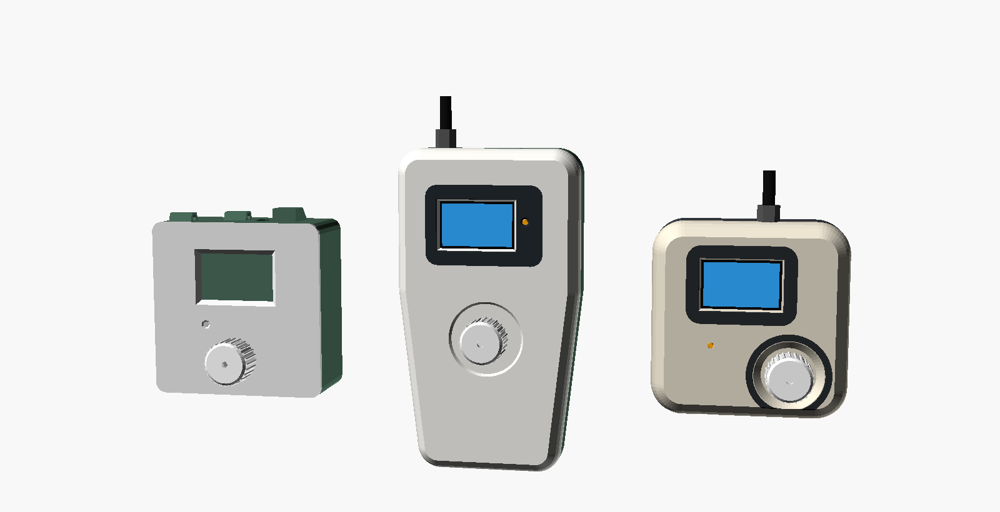
*To scale, left to right: v0.1 (74.4 x 78 x 31.6), **A Grip** (78.6 x 138.3 x 22.8), **B Stone** (79.4 x 80.4 x 29.6).*

---

## Concept A: "Grip"

**Pitch:** a slim handheld about the size of a SkyCaddie. The battery sits in the handle and the dial sits right where your thumb rests.

| Front | Back (palm pad + mount socket) | Section | Lid off |
|---|---|---|---|---|
| 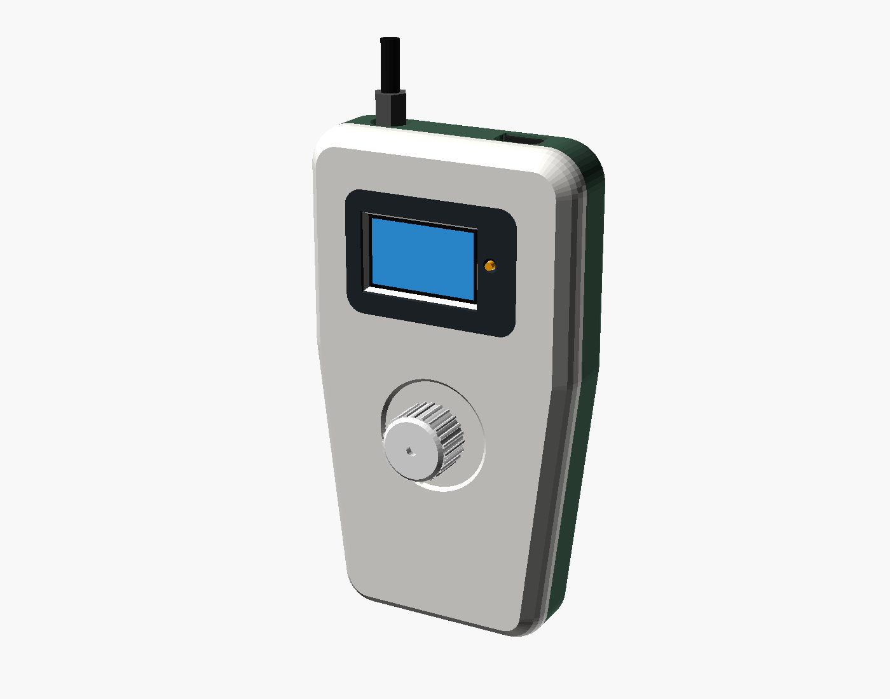 | 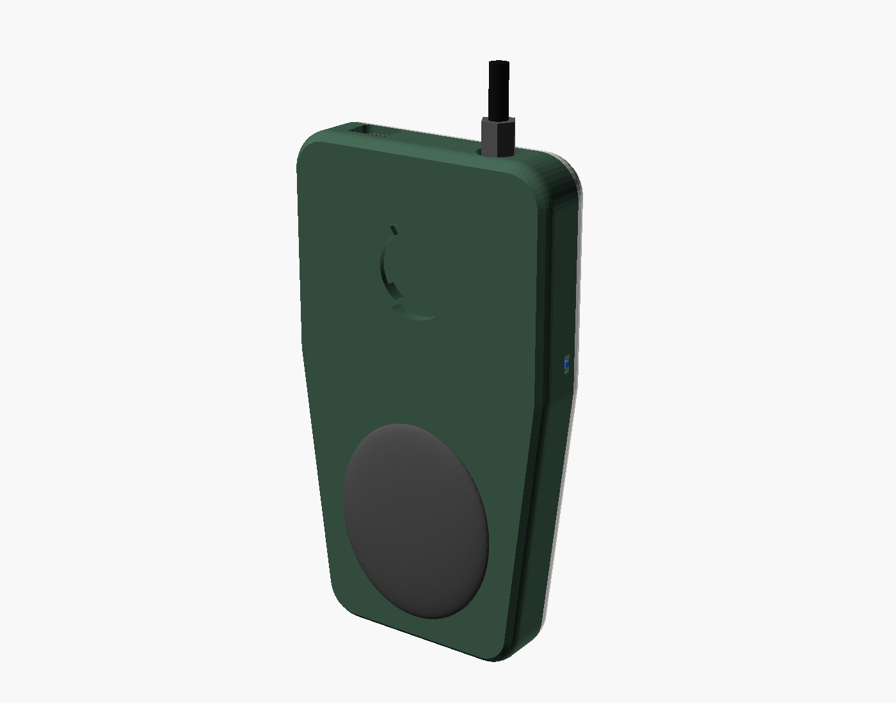 | 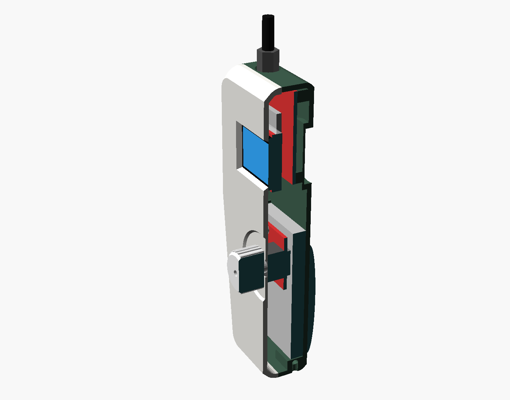 | 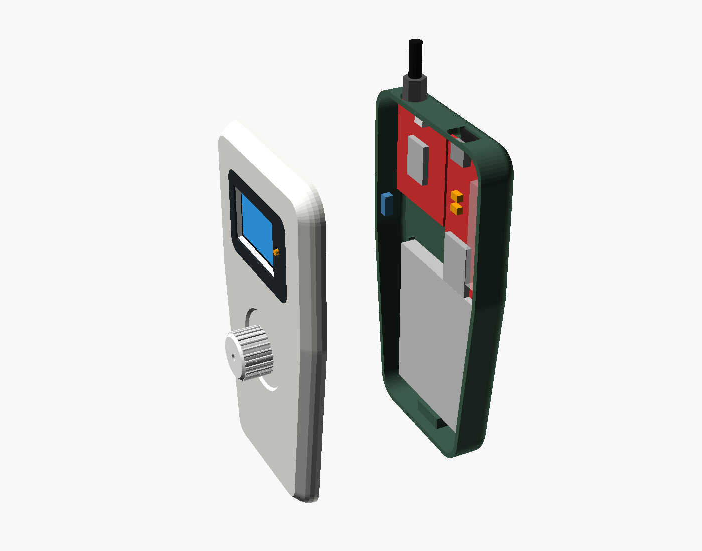 |

**Outer size:** 78.6 wide at the head, tapering to 62.6 at the bottom of the handle. It is 138.3 long and 22.8 deep, or 26.3 deep over the palm pad. The envelope is about 223 cm³.

**How it's held:** like a TV remote. Your fingers wrap the narrow handle and your thumb lands on the dial, 58 mm from the bottom end, in a shallow 32 mm thumb pocket. The screen sits above your hand, so the thumb never covers it. The battery is the heaviest part and it sits in the palm, so the device doesn't feel top-heavy. A separate TPU palm pad fills the hollow of the palm. Wrist-strap holes are in the bottom end.

**How it's mounted:** the TwistLock socket is flush in the back of the head, behind the screen. On a cart bar, the handle hangs below the clamp. I checked it clears the clamp and a 25.4 mm bar at 55° of tilt (`part="chk_cart"`).

**Internal layout.** The boards sit side by side instead of stacked, so the inside is only 18.4 mm deep:
- **Handle:** the 55 x 64 x 6.4 pouch lies flat on the floor. The Twist hangs from the lid bosses directly above it. Its encoder pins clear the pouch by 0.4 mm, plus the 0.6 mm swell allowance.
- **Head:** the GPS (left, SMA pointing up) and the Thing Plus (right) sit side by side on 5.5 mm floor bosses. The Thing Plus is rotated 180° so its USB-C faces the top end. There's no internal plate. The OLED sits over both boards with its glass against the lid.
- A 3.5 mm channel between the two zones carries the battery lead and the Qwiic cables.

**Where everything is:**

| Item | Location |
|---|---|
| USB-C and microSD | Top end, right |
| SMA | Top end, left |
| RESET plunger | Right of the screen. That's where the Thing Plus RESET lands after the rotation; the screen is nudged 4 mm left to make room. |
| EN switch | Left side, below the GPS |

**Tradeoffs:**
- **Printability.** No supports are needed. The back shell prints back-down: the back is flat, and the edges start with a 45° lead-in before the radius. The lid prints face-down, and the dark screen panel can be the first layers from the X2D's second nozzle (or the lid can be single-colour). The thumb pocket floor is a 30 mm bridge, 1 mm deep. The socket lip sits on the bed and its chamber ceiling is a 25.6 mm bridge. The palm pad prints flat side down.
- **Size.** Thinnest of the three, but 138 mm long. It fits a jacket pocket, not a trouser pocket.
- **Comfort.** The best of the three for one-handed use: narrow grip, a natural thumb position, and the screen is never under your thumb.
- **Cost and complexity.** About the same as v0.1. It loses the internal plate and gains the palm pad. The new layout is the risk (see below).

**Unproven:**
- **Thing Plus plug keep-out.** I assumed the JST battery and Qwiic plugs need a 7 mm side clearance along the board edge that now faces the right wall (local y 8–50). Verify the real positions. If the JST sits elsewhere, the head may need re-balancing.
- **GPS Qwiic port.** The design uses the GPS's other Qwiic port, not J4 on the SMA edge, so it doesn't need v0.1's pocket bulge. Confirm that port is reachable.
- **Qwiic cable lengths.** The cables now run between the zones (Thing Plus → GPS → OLED → Twist). Check them against the cable kit lengths.
- **Palm pad attachment.** It would attach with VHB tape plus two locating pins. That isn't modelled.

---

## Concept B: "Stone"

**Pitch:** v0.1's proven internal stack in a soft, compact palm stone. The dial moves to the lower right for the thumb, which also makes the case thinner.

| Front | Back (socket + strap holes) | Section through the dial | Exploded |
|---|---|---|---|
| 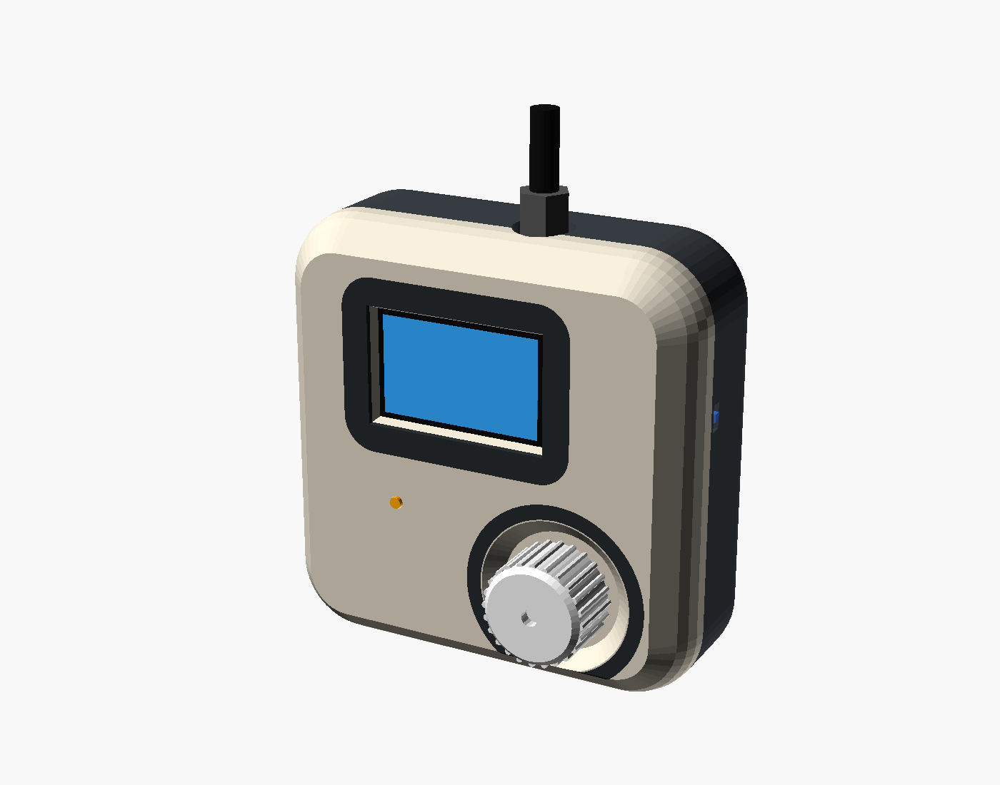 | 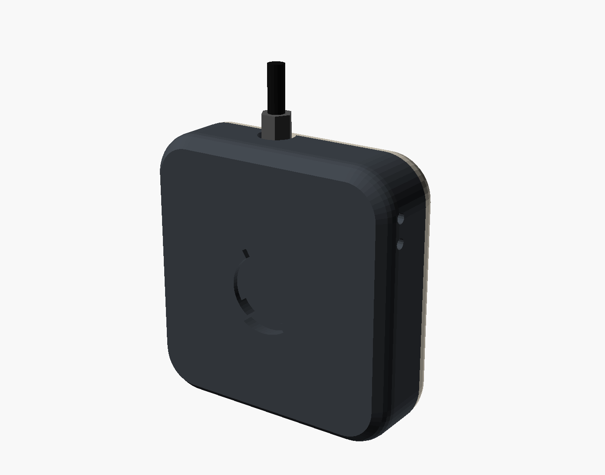 | 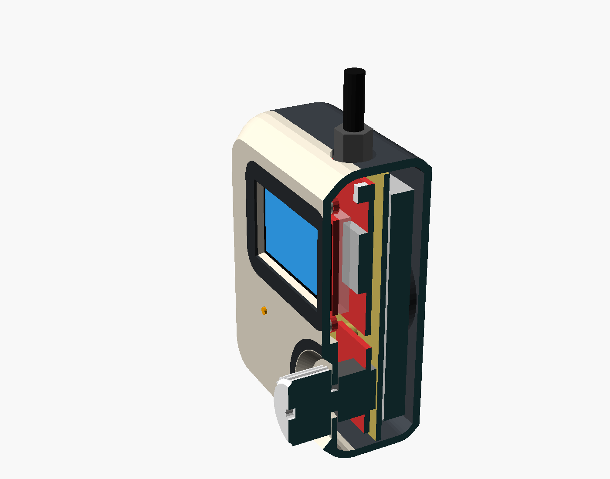 | 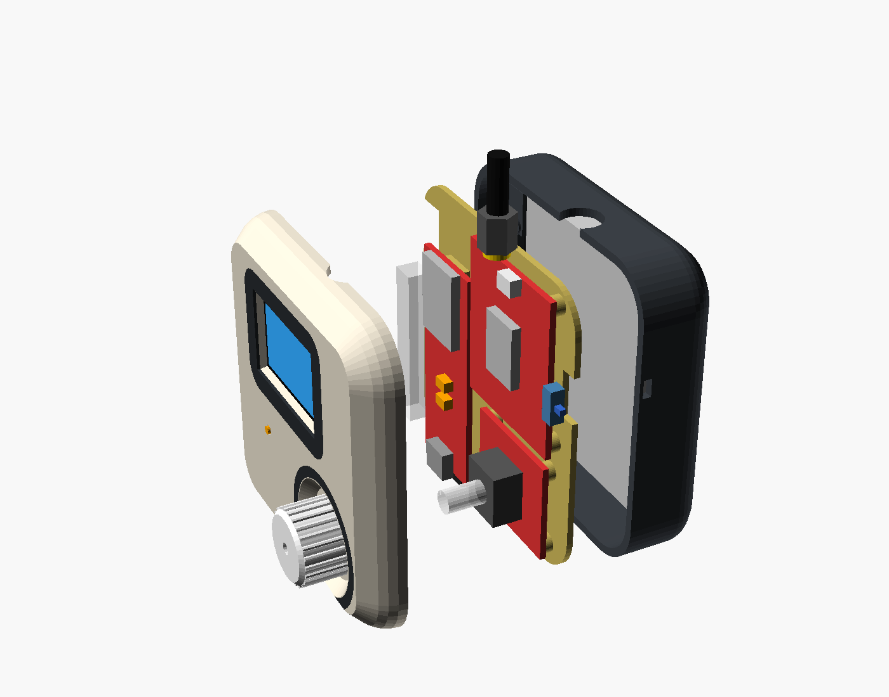 |

**Outer size:** 79.4 x 80.4 x 29.6 mm. The envelope is about 177 cm³, about the same as v0.1 but 2 mm thinner, with no sharp edges and nothing sticking out of the back.

**How it's held:** cupped in the palm like a stopwatch. The dial sits in the lower-right corner, about 22 mm from the right edge and 19 mm from the bottom, so a right thumb rests on it without shifting your grip. The knob sits in a 3 mm deep dial cup, so it's lower and protected in a bag. Wrist-strap holes are on the left side.

**How it's mounted:** the TwistLock socket is in the centre of the back. The device is compact and centred on the clamp, so it's the tidiest of the two on a cart.

**Internal layout.** Battery on the floor, then the chassis plate, then the Thing Plus and GPS on the plate, then the OLED under the lid, as in v0.1. Three changes:
- **The Twist moves off the boards** into the free plate corner beside the GPS, on 2 mm plate standoffs. In v0.1 it stacked on the Thing Plus, which set the depth. Now the encoder sits just under the dial-cup floor.
- **The GPS sits 2.2 mm off the top wall** instead of 0.6, so the top-right corner can have an 11 mm radius.
- **The pouch is raised 2.6 mm** onto the socket boss. That's the cost of a flush mount socket. Without the socket, B would be 27 mm deep.

**Where everything is:**

| Item | Location |
|---|---|
| USB-C and microSD | Bottom end (as v0.1) |
| SMA | Top end |
| RESET | Below the screen, lower left |
| EN switch | Right side, beside the GPS |

**Tradeoffs:**
- **Printability.** Same rules as A, and no supports are needed. The dial cup has a 45° wall so it prints face-down. I dropped the crowned face I first tried, because a crowned face won't sit flat for a face-down print.
- **Size.** About v0.1's volume. It's wider and taller than v0.1 (79 x 80 vs 74 x 78) but thinner.
- **Comfort.** Fine in the hand and nicer than v0.1 (rounded everywhere, thumb-placed dial). It isn't a true grip, though: your fingers hold the edges.
- **Cost and complexity.** The lowest risk of the two, because the stack and the plate are v0.1's. It's right-thumb biased and can't be mirrored, because the Thing Plus occupies the bottom-left corner.

**Unproven:**
- **SMA reach.** With the 2.2 mm gap, the jack's thread starts 0.5 mm inside the inner wall (in v0.1 it started 1.1 mm outside). The plug nut has to reach about 1.7 mm into the 11 mm port. Check with the real antenna plug. If it doesn't reach, thin the wall locally or widen the port.
- **Knob grip.** The knob gives 2–5 mm of finger room in the cup and stands about 9 mm proud, so you turn it from the top and side. A test print of the lid will tell whether that's comfortable.
- **Encoder shaft length.** I assumed 10 mm of shaft above the encoder body, as v0.1 modelled. The knob then engages 8 mm.

---

## Concept B2: "Stone, layered"

You picked B. B2 is the iteration: a **smaller footprint, bought with depth**, and a softer side section. `concept_b_stone.scad` is unchanged, for comparison.

**B2 is now print-ready.** See [Printing B2](#printing-b2) below. Making it printable changed four things in the concept described here:
- **Dial cup removed.** The Twist moved up 2 mm so its encoder bears on the lid, as in v0.1.
- **Lean reduced from 6 to 4.9 mm,** so the bottom corners stay under 45°.
- **Wrist-strap passage moved** to the bottom end.
- **Lid retention added:** tabs inside the shell and three side screws.

The text below is updated to match.

| Front | Side (the lean) | Back | Section through the RESET plunger | Exploded layers |
|---|---|---|---|---|
| 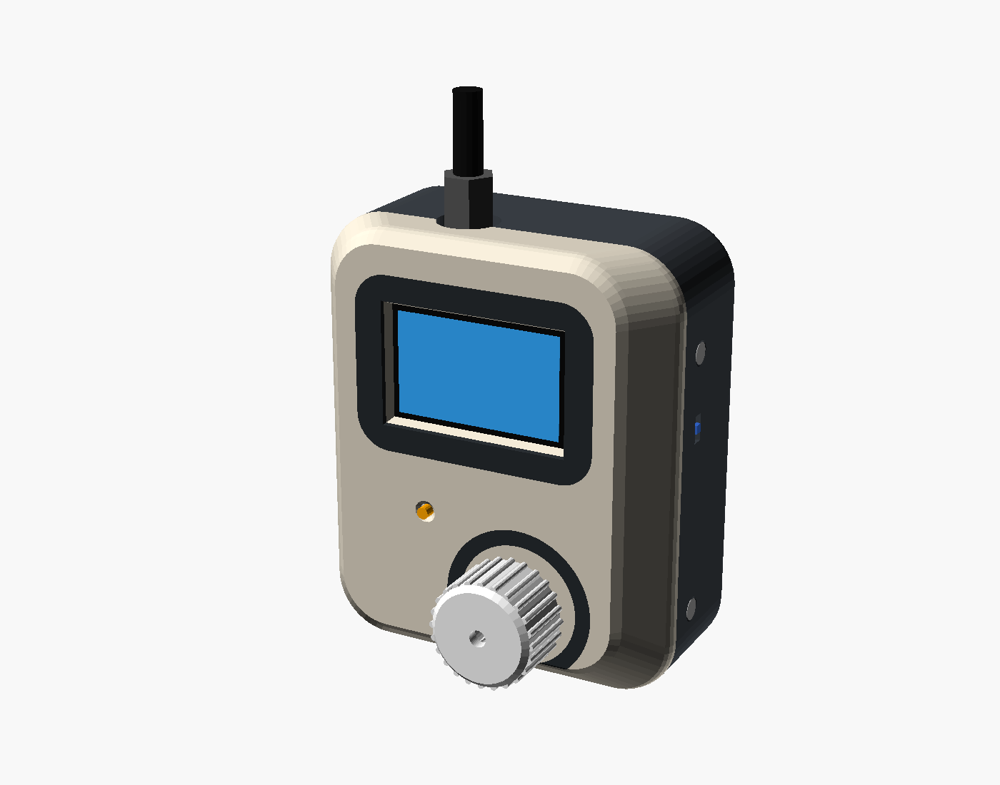 | 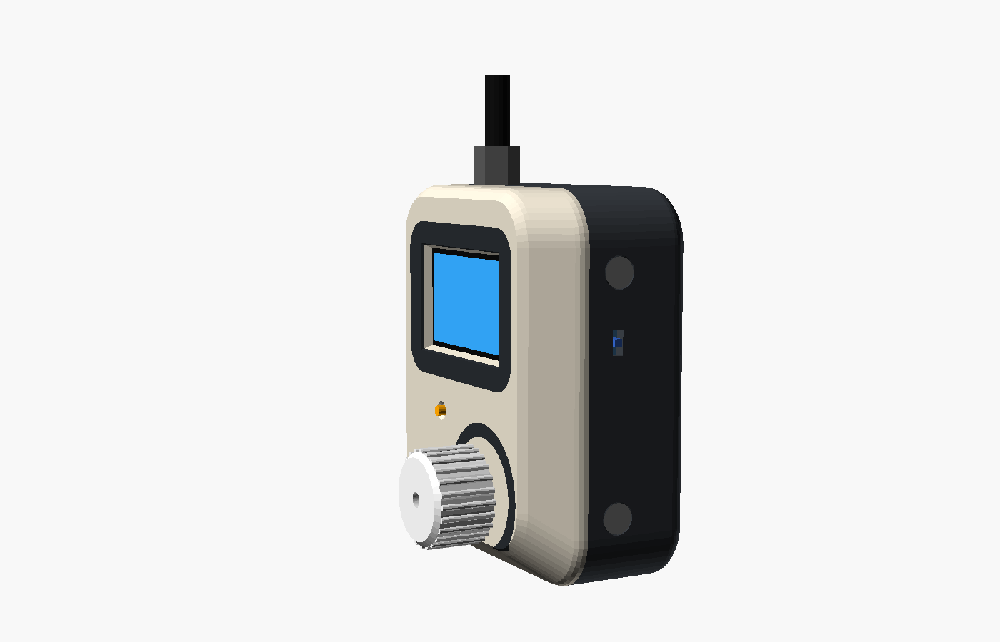 | 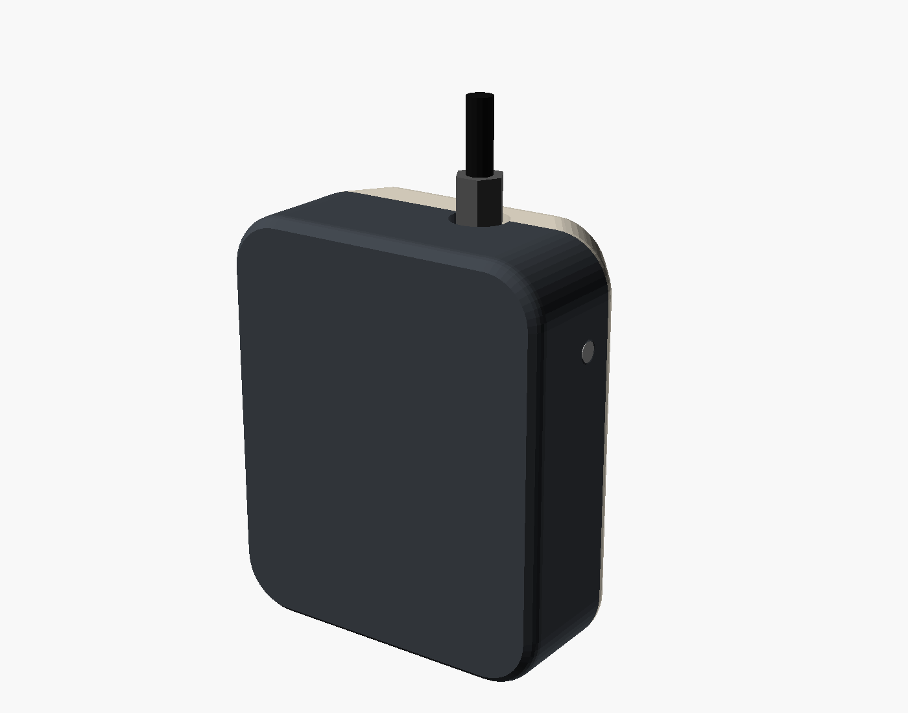 | 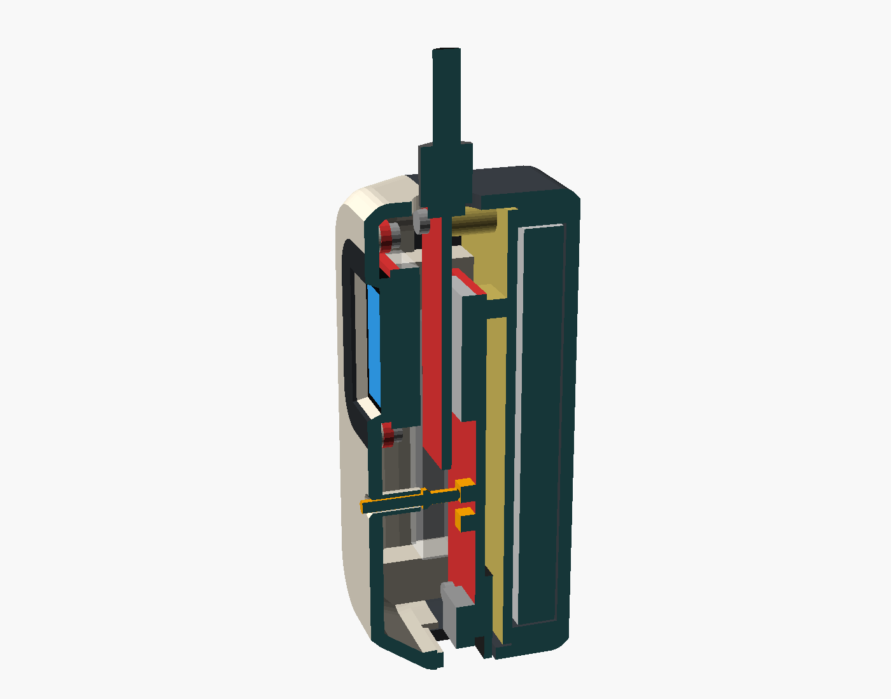 | 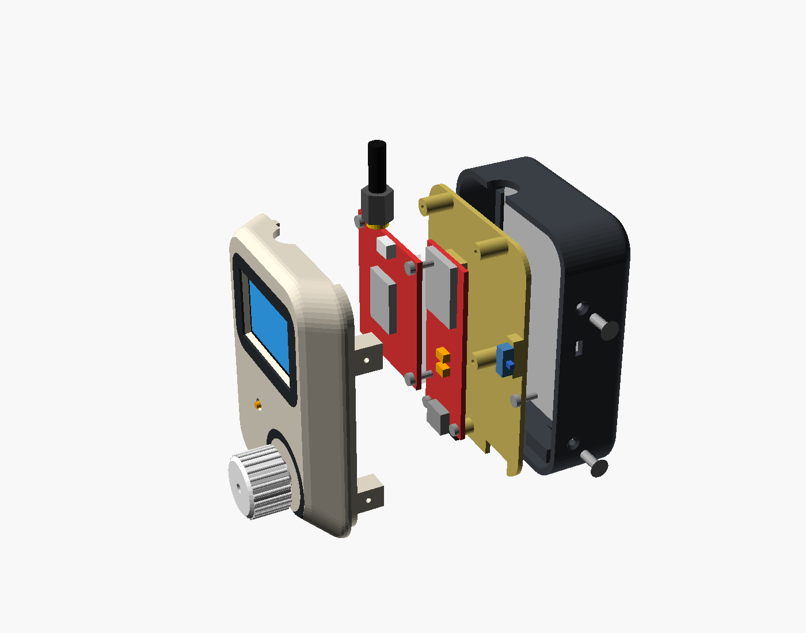 |

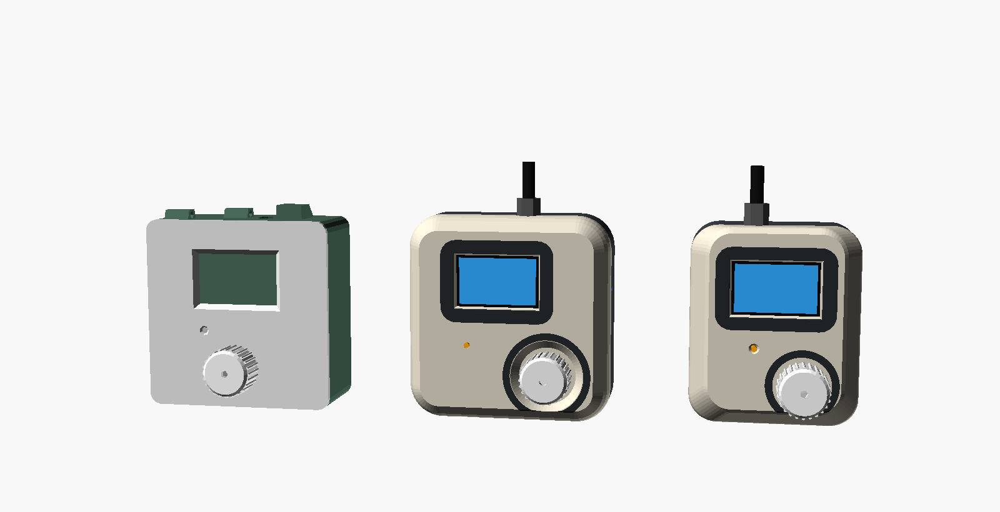
*To scale, left to right: v0.1, B, B2.*

**Outer size:** 63.0 x 75.5 x 32.6 mm, about 144 cm³, without the mount socket (the default for the first print). With it: 63.0 x 75.5 x 34.8 mm, about 153 cm³.

**Mount socket is optional.** `mount_socket = false` (the default) drops the TwistLock socket and its boss. The pouch then sits 0.4 mm off the inner floor (`batt_lift`) instead of 2.6 mm on the boss, and the back edge radius tightens from 6 to 3 mm so the pouch corners clear it. All fit checks pass both ways. To get the socket back, set `mount_socket = true`. The cart and strap renders are made with it on. The table and layer stack below describe the version with the socket. Without it, every height above layer 1 drops by 2.2 mm.

| | B | B2 | Change |
|---|---|---|---|
| Width | 79.4 | 63.0 | −16.4 mm |
| Height | 80.4 | 75.5 | −4.9 mm |
| Depth | 29.6 | 34.8 | +5.2 mm |
| Footprint area | 6,384 mm² | 4,757 mm² | −25% |
| Envelope volume | ~177 cm³ | ~153 cm³ | −14% |

**Layer stack.** Heights are above the inner floor; add 2.2 mm for the height above the outer back.

| Layer | Part | z (mm) |
|---|---|---|
| 1 | 2 Ah pouch, resting on the TwistLock socket boss (socket recess is 3.6 deep, plus a 1.0 mm skin) | 2.6–9.0, plus 0.6 swell allowance |
| 2 | Chassis plate | 9.6–11.2 |
| 2 | Thing Plus, on 2.4 mm standoffs over its microSD socket. Left side, USB-C at the bottom end, plug keep-out against the left wall. | board 13.6–15.2; tallest part 18.6; plug keep-out to 19.6 |
| 3 top | GPS. SMA edge 0.6 mm off the top wall, as in v0.1. | board 19.2–20.8; J4 to 23.8 |
| 3 top | OLED, in front of the GPS. Glass against the lid. | PCB 27.2–28.8; glass top 30.4 |
| 3 bottom | Twist, on its own, hung from lid bosses. Its encoder body bears on the lid, as in v0.1. The PCB overhangs the Thing Plus's right edge; the encoder pins sit over the bare plate. | PCB 21.0–22.6; encoder top 30.4 (= lid inner) |
| 4 | Lid | inner 30.4; face 32.6 |

**What sets the size:**
- **Width (58.6 mm inside)** is the pouch (55) plus 1.8 mm per side, so the plan corners can have an 8.5 mm inside radius.
- **Height (71.1 mm inside)** is set by the RESET plunger, not by the pouch. The Thing Plus RESET is fixed 28.2 mm from the USB end. Its plunger needs a straight path to the face, so the GPS has to start just above it (pin plus 0.6 mm gap = 29.9). Add 40.6 mm of GPS and the 0.6 mm SMA gap and you get 71.1.

  By coincidence, the pouch plus corner margins also comes to about 71. So tighter corners alone wouldn't shrink it.

**Checking the proposed layering against the numbers:**
- **"The battery sets the footprint."** Only for width. Height is set by the RESET-to-GPS column, as above.
- **Thing Plus on the left, USB-C at the bottom.** Yes. Its plug keep-out faces the left wall.
- **GPS SMA against the top wall.** Yes, at 0.6 mm as in v0.1. I checked the jack that hangs 2.4 mm below the board at its axis: it sits at y ≥ 70.5, beyond the Thing Plus's far end at 60.9, and above the plate.
  J4 can't be used with only 0.6 mm to the wall, so the design uses the GPS's other Qwiic port.
- **Twist alone in the bottom zone.** Yes. The Twist sits 1.35 mm right of the plunger pin, and its lid bosses clear the plunger's guide tube by 0.5 mm. The GPS sits 0.6 mm above the pin.
  The two zones share the depth as you proposed: the encoder top and the OLED glass top both sit at the lid's inner face.
- **Target ~62 x 70.** I got 63 x 75.5. The 5.5 mm of extra height is the RESET path.

  One option to cut it, which I didn't model: rotate the GPS so the SMA comes out of the upper right side. That should save roughly 3 mm of height (38.4 mm of GPS instead of 41.2 in that column), at the cost of the antenna cable leaving from the side.

**The dial.** The concept had a 2.4 mm dial cup, which cost no depth. The print version drops it, for two reasons:
- **Twist screw heads.** With the cup, the Twist sat 0.4 mm above the Thing Plus. The screw heads under its left-hand holes (1.75 mm tall) had nowhere to go, because those holes sit over the Thing Plus.
- **A 20 mm ceiling.** The cup's floor was a 20 mm ceiling in the face-down lid print.

Raising the Twist until the encoder bears on the lid fixes both, and it's v0.1's proven arrangement. The knob sits 2 mm off the flat face, as in v0.1, inside a dark printed ring.

I also rejected a raised guard ring around the knob. It would be a raised feature on the face, and the face-down lid can't print one without supports.

**Less blocky.** The battery limits the plan corners to an 8.5 mm inside radius, so the softness comes from the section, shaped like a lens:
- **Back:** flat (the pouch spans the full width), with a 6 mm edge radius and a 45° printable lead-in.
- **Sides:** straight up to a shoulder 3 mm above the Thing Plus's tallest part (z 21.6).
- **Lean:** above the shoulder, the left, right and bottom sides lean 4.9 mm inward over a 7 mm rise. That's 35° from vertical on the sides and 44.7° on the diagonal at the bottom corners, where the two leans add. The face is therefore 9.8 mm narrower than the back.
- **Top:** no lean, because the SMA, J4 and the OLED's top ears are within 2 mm of the top wall.

The parts would allow about 9 mm of lean. Printing is what limits it. I first used 6 mm, but at the bottom corners the diagonal flank was then 50.5°, which can't print face-down. 4.9 mm keeps that diagonal at 44.7°.

**No wedge.** I decided against a wedge, and the direction matters:
- **Thicker at the dial (bottom) end** tilts the screen *away* from someone looking down at a device held at waist height.
- **Thicker at the top end** tilts it toward you, but it adds depth to the OLED/GPS zone, which is already the deepest part.

The cart knuckle provides tilt when mounted.

**Where everything is:**

| Item | Location |
|---|---|
| Dial | Lower right. Centre 19.1 mm from the right edge and 16.9 mm from the bottom. |
| RESET | Lower left, beside the dial |
| USB-C and microSD | Bottom end |
| SMA | Top end, left of centre |
| EN switch | Right side, at layer 2 height |
| Wrist-strap holes | Bottom end, right of the port bay |
| Lid screws | Three M3 countersunk: one at the right side low, one at each side high |
| TwistLock socket | Centre of the back |

I verified all of these in the cart scene, with the same 55° and 25.4 mm bar check as before.

**Printability (PETG on the X2D, no supports):**
- **Back shell:** prints back-down, with vertical walls up to the shoulder.
- **Lid:** prints face-down. Its flanks widen at 35° (44.7° at the bottom corners) as it prints.
- **Plate:** prints flat. It carries the Thing Plus standoffs and three GPS standoffs, which are 8 mm tall.

Details and the overhang audit are in [Printing B2](#printing-b2).

**Unverified:**
- **Thing Plus parts under the Twist.** The Twist PCB overhangs a 7 mm strip along the Thing Plus's right edge. Its two left screw heads sit 0.65 mm above the 3.4 mm part height I've assumed for the Thing Plus throughout.
- **GPS mounting.** The fourth GPS mounting hole sits over the Thing Plus, so the GPS is held by three plate standoffs. The OLED and lid stop it from tipping.
- **GPS Qwiic.** The design uses the GPS's other Qwiic port, as in A. Its position needs checking.
- **Assembly order and cables.** The Qwiic cables now fold between layers 2 and 3. See [Printing B2](#printing-b2).
- **Plug keep-out.** The 7 mm Thing Plus keep-out is still an assumption.

  If the real JST plug sits lower on the board, I can't fix that by sliding the Thing Plus: RESET is fixed relative to the board, and the Thing Plus already sits against the keep-out on its left. It would only free up room on the left side.
- **Battery.** Per your call, the 2 Ah pouch stays. A ~1 Ah cell wouldn't meaningfully shrink B2: the inside width is also set by the RESET-plus-Twist row (about 57 mm), and the height by the RESET-plus-GPS column (71 mm). It would save at most about 1.5 mm of width and a fraction of a millimetre of depth.

## Printing B2

`concept_b2_stone.scad` is the source. `./export_b2.sh` writes the five print parts, already in print orientation, to `stl_b2/`. `render_all.sh` runs it as well.

The default is **without the mount socket** (`mount_socket = false`). To print the socket version, run `./export_b2.sh -D 'mount_socket=true'`.

| STL | Orientation | Size (mm) | Notes |
|---|---|---|---|
| `back_shell.stl` | Back down | 63.0 x 75.5 x 21.6 | Pouch tray, plate ledges, wrist-strap block, side-screw countersinks |
| `lid.stl` | Face down | 63.0 x 75.5 x 21.4 | Face, OLED and Twist bosses, RESET guide tube, locating lip, 4 tabs (3 with inserts), port-bay tooth |
| `plate.stl` | Flat | 57.8 x 70.3 x 9.6 | Thing Plus standoffs and far-end rest, 3 GPS posts, switch shelf |
| `knob.stl` | Upright | 19.2 x 19.2 x 12.0 | v0.1's `knob()`, unchanged |
| `plunger.stl` | Tip down | 3.4 x 3.4 x 15.8 | RESET plunger |

Each STL is a single solid in which every edge has exactly two faces, counted with vertices rounded to 1e-6 mm.

| STL | Edges | Faces per edge |
|---|---|---|
| back_shell | 4434 | all 2 |
| lid | 6876 | all 2 |
| plate | 2274 | all 2 |
| knob | 2586 | all 2 |
| plunger | 585 | all 2 |

All five also slice in Bambu Studio 02.08.02.61's CLI (`--slice 0`) with return code 0 and no warnings. That was with the CLI's default printer and filament profile, not an X2D/PETG profile. Default-profile times: back shell 2 h 36 min, lid 2 h 00 min, plate 1 h 00 min, knob 16 min, plunger 2 min (the slicer added a brim).

### Print settings (Bambu X2D, PETG)

- 0.4 mm nozzle, 0.2 mm layers, 3–4 walls, 20% gyroid, no supports (as v0.1).
- **Lid:** face down on a textured PEI plate. The dark screen panel and dial ring are the top 0.6 mm of the face, so the X2D's second nozzle can print them as the first three layers. Or print the lid in one colour.
- **Plunger:** 0.12 mm layers, as in v0.1. It stands on a 1.2 mm tip, so give it a brim, or print several at once.
- **Knob:** clear or translucent PETG, so the encoder's RGB shows through the centre light pipe (as v0.1).

### Hardware

| Qty | Item | Where |
|---|---|---|
| 3 | M3 heat-set insert, 4.0 mm hole, ≤ 5.8 mm long (v0.1 size) | Lid tabs: right low, left high, right high |
| 3 | M3 x 8 countersunk (ISO 10642 flat head) | Through the shell's side walls into those inserts |
| 2 | M2.5 x 5 pan head, self-tapping into PETG | Thing Plus to plate standoffs |
| 3 | M2.5 x 6 pan head | GPS to the three plate posts |
| 4 | M2.5 x 5 pan head | Twist to lid bosses, from behind. Not 8 like v0.1: the lower holes sit under the leaning flank. |
| 4 | M2.5 x 4 pan head | OLED ears to lid bosses (as v0.1) |
| 2 | M2.5 x 6 pan head | Plate to the bottom and top ledges |
| 1 | SS12D00G3-style slide switch plus ~6 cm of 28–30 AWG wire | Right wall slot, hot-glued to the plate's switch shelf (as v0.1) |
| | Qwiic cables | Thing Plus → GPS → OLED → Twist |

Every screw length is set so the screw **can't reach a skin, a board or the pouch**:
- Each screw is modelled as a solid (head, shank and insert body) and included in the fit checks.
- Each pilot hole stops at least 0.6 mm short of an outer face.
- A longer screw fails a check. For example, an M2.5 x 7 in the Thing Plus would reach the pouch, an M2.5 x 7 in the OLED would come out of the face, and an M2.5 x 8 in the Twist (v0.1's length) would come out of the bottom flank.

### Where this differs from v0.1, and why

- **Lid retention.** v0.1 hooks two lid tongues under the top wall and puts two M3 screws through the back into the lid. Neither works in B2:
  - **Back screws:** the pouch fills the floor to within 1.8 mm of the side walls, so there's no room for back-to-lid screw posts.
  - **Tongues:** the GPS edge sits 0.6 mm from the top wall, right where they'd go.

  So instead, four tabs on the lid drop inside the back shell, and M3 x 8 countersunk screws go horizontally through the side walls into heat-set inserts in three of the tabs.

  The fourth (lower-left) tab has no screw. A screw head there would sit on the bottom-left corner curve and stand up to 1 mm proud, and the Thing Plus plug keep-out blocks the straight wall above it. That tab still locates the lid and clamps the plate.

  The lid also has a locating lip (v0.1's 0.2 clearance, 1.2 thick, 3 deep), notched where the GPS edge, the SMA, the Twist corner and the USB port bay are.
- **Lip and tabs fused into the lid.** Above the rim the lid wall leans inward, so a plain lip and tabs would join it only along a knife edge, and the lip would print as a loose ring. So the lid is built by subtracting one cavity:
  - Inside the lip, the cavity is the lip's inner outline.
  - Above the rim, it's a convex hull from that outline up to the lid's own inner wall, 2.4 mm higher. That thickens the wall just above the rim, with a face about 7° off vertical on the leaning sides and 30° on the top side.

  The lip, tabs and tooth overlap the lid by 0.3 mm. No feature touches another edge-to-edge.
- **Plate.** v0.1 screws its plate onto three floor pillars, but B2 has no free floor beside the pouch. Instead the plate:
  - rests on ledges along the bottom wall, the top wall and the right wall;
  - is held by two M2.5 x 6 pan screws into the bottom and top ledges;
  - is clamped down by all four lid tabs.

  There's no left ledge, because the pouch lead runs up the 1.8 mm left margin to the plate's lead notch (v0.1's notch position, under the Thing Plus JST).

  The Qwiic cables don't cross the plate. The Thing Plus, GPS, OLED and Twist are all above it, and the cables run up the left plug channel.
- **Twist.** It hangs from four lid bosses and its encoder bears on the lid, as in v0.1. It can't sit on plate standoffs, because its left-hand holes are over the Thing Plus.
- **USB-C and microSD.** They share one "port bay" that's open up through the shell rim, so the back shell has no 12.6 mm bridge over the opening. A tooth on the lid fills the top of the slot.

### Overhang and bridge audit

I checked every downward-facing surface steeper than 47° from vertical in each STL, in print orientation.

| Part | What's left (all acceptable) |
|---|---|
| Back shell | The EN slot's 4.8 mm bridge; tops of the Ø3.4 side-screw holes; teardrop tips on the wrist-strap holes |
| Lid | The tops of the three Ø4 horizontal insert holes; one 2 mm ceiling at the Twist-corner lip notch |
| Plate | Nothing |
| Plunger | Nothing. The collar has a 45° underside. |
| Knob | The 6.2 mm bore ceiling (v0.1 part) |

Things I fixed to get there:
- A 50.5° lean at the lid's bottom corners
- The knife-edged lip, and the coincident faces where the lip met the thickened wall. The latter left 114 kissing edges in an earlier lid STL; it now has 0.
- A 12.6 mm bridge over the USB-C opening
- Round wrist-strap holes (now teardrops)
- The dial cup's 20 mm ceiling

### Fit checks

These all run in the `.scad` file, and every one exports empty or zero-volume, both with and without the socket.

| Part | What it checks | Result (total overlap) |
|---|---|---|
| `chk` | Shell + plate against every component | 0.0000 mm³ |
| `chk_out` | Components + screws outside the outer skin | 0.0000 mm³ |
| `chk_comp` | Every pair among the 17 solids: boards, pouch, switch, plunger, plate, lid, shell features, 6 screw groups, inserts. 15 intended contacts are exempt (e.g. a screw in its own pilot). | 0.0001 mm³ |
| `chk_plate` | Plate against the shell and lid | 0.0000 mm³ |
| `chk_pilot` | Pilot holes against the outer 0.4 mm skin and the pouch | empty |
| `chk_cart` | Device against the cart clamp and bar (socket version) | empty |

**Deliberate failures,** each of which trips its check:

| Change | Check | Overlap |
|---|---|---|
| OLED screw M2.5 x 7 | `chk_out` | 30 mm³ |
| Twist screw M2.5 x 8 | `chk_out` | 0.26 mm³ |
| Thing Plus screw M2.5 x 7 | `chk_comp` | 13 mm³ |
| Side screw M3 x 12 | `chk_comp` | 8.8 mm³ |
| Screw added to the lower-left tab | `chk_out` | 8.3 mm³ |
| Tabs pushed 1 mm into the plate | `chk_plate` | 192 mm³ |
| Lean of 9 mm | `chk` | 23 mm³ |
| Cart clamp too close | `chk_cart` | 433 mm³ |

**Correction to earlier B2 results.** Until this revision, a dangling-`else` bug in the file meant `chk_out`, `chk_plate` and `chk_cart` never actually ran for B2: they returned empty no matter what. They now run, and they caught three real problems that are fixed above: Twist screws through the flank, side-screw heads on corner curves, and pilots through the skin.

### Assembly order

1. **Lid.** Press the 3 M3 inserts into the lid tabs (lid on its side, iron horizontal).
2. Screw the OLED (glass against the lid) with 4 x M2.5 x 4.
3. Screw the Twist with 4 x M2.5 x 5 from behind, encoder through its hole. Connect Qwiic OLED → Twist.
4. Drop the RESET plunger into its tube from inside. Its collar keeps it from falling out the front.
5. **Back shell.** Lay the pouch in, with its lead running up the left margin.
6. **Plate.** Screw the Thing Plus (2 x M2.5 x 5) and the GPS (3 x M2.5 x 6) to the plate.
7. Solder the EN switch to the Thing Plus EN and GND pins. Connect Qwiic Thing Plus → GPS.
8. Drop the plate in, feeding the pouch lead up through the left notch to the Thing Plus JST. Screw it down with 2 x M2.5 x 6.
9. Set the switch actuator into its slot and hot-glue the switch to the shelf and wall.
10. Connect Qwiic GPS → OLED. Lower the lid straight down, with the lip inside the shell, then fit 3 x M3 x 8 countersunk screws through the sides.
11. Press the knob on (2 mm clear of the face). Screw on the antenna.

### Measure before you print

1. **Thing Plus plug keep-out.** I assumed the JST and Qwiic plugs need 7 mm along the left edge, from 8 to 50 mm from the USB end. Check the real positions. If the keep-out starts higher up the board, the lower-left tab could take a fourth screw.
2. **Thing Plus parts under the Twist.** In Thing Plus board coordinates, that's the strip 15.7–22.9 mm across and 0–25 mm from the USB end. The Twist PCB and its two left screw heads sit 0.65 mm above a 3.4 mm part height. Anything taller there collides.
3. **The GPS's other Qwiic port.** The top-edge J4 is unusable, 0.6 mm from the wall. Where the other port sits decides the GPS-to-OLED cable route.
4. **3-post GPS mounting.** The fourth GPS hole is over the Thing Plus and gets no post. Check the GPS doesn't rock. If it does, a dab of foam or hot glue on its corner over the Thing Plus fixes it.
5. **The pouch.** Check it fits the 55 x 64 x 6.4 pocket. Check its lead exits where it can run up the left margin; there's 1.8 mm between the pouch and the left wall.
6. As in v0.1, also check:
   - the OLED glass and tape thickness (1.6 mm);
   - the encoder body (12.4 x 13.4 x 7.8) and shaft length (10 mm above the body);
   - the slide switch size;
   - whether the SMA plug threads fully (0.6 mm board-to-wall gap, 11 mm port).

**Fit print first.** Print only `plate.stl`: about 7 cm³, the quickest part. Screw the Thing Plus and GPS onto it. That checks the standoff and post positions, the 3-post GPS mount, the plug keep-out along the Thing Plus's left edge, and the clearance under where the Twist will sit.

Next, print `back_shell.stl` to try the pouch and the plate in the tray before committing to the lid.

---

## Shared mount: "TwistLock"

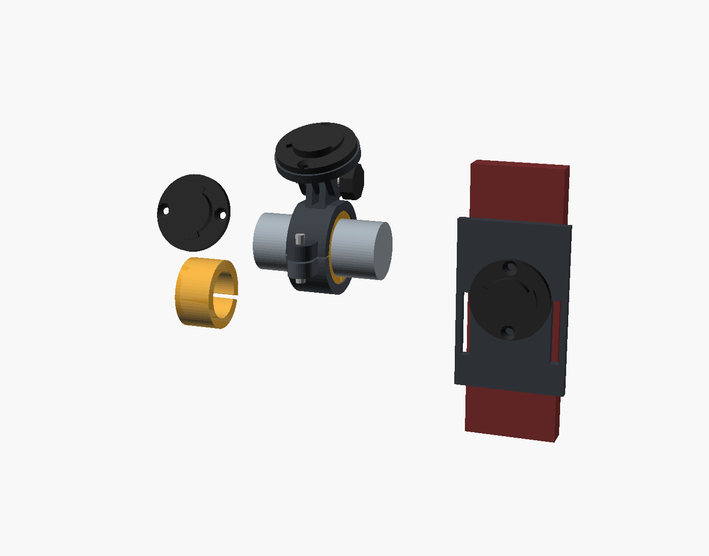
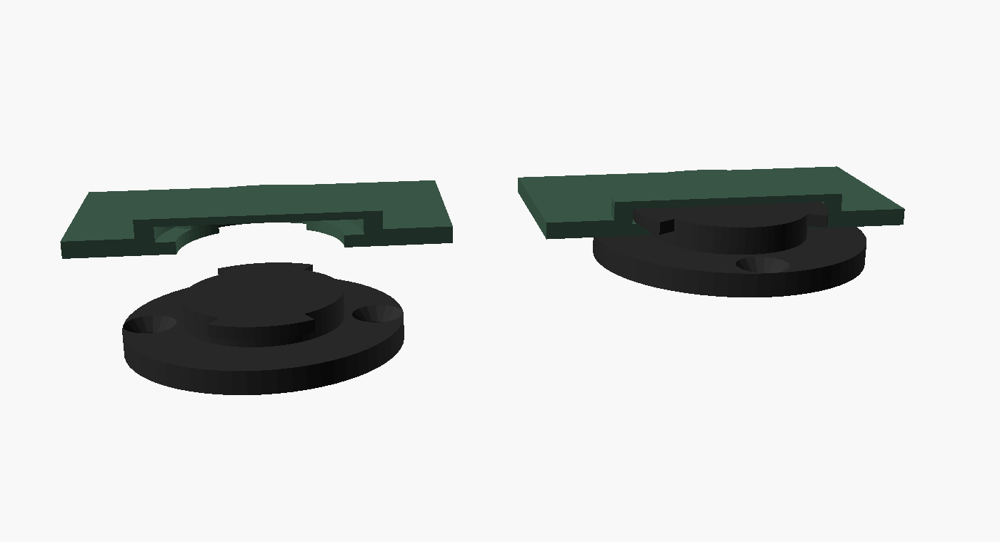

**Device side.** A recessed quarter-turn socket in the back, so the back stays flush and nothing digs into your palm. The recess is 3.6 mm deep, 4.6 mm including the skin behind it:
- The opening is a 20.6 mm neck hole with two lug notches.
- Behind the 1.6 mm lip is a 25.6 mm chamber with rotation stops at 90°.
- A detent bump on each lug clicks into a dimple in the chamber ceiling. The detent isn't modelled.

**To mount:** push the device onto the puck with the screen turned sideways, then twist 90° until it stops and the screen is upright.

**Mount side.** One male **puck** (35 mm flange, 20 mm neck, two 60° lugs on a 25 mm circle, 2x M3 countersunk). The same puck screws onto:
- **Cart-bar clamp.** Two halves with a 32.5 mm bore, held by 2x M4 x 25 bolts and nuts. Split TPU shims step the bore down to 25.4 mm (1") or 22.2 mm (7/8"), which covers the 22–32 mm range. A GoPro-style 2/3-prong knuckle with an M5 bolt and thumb nut sets the screen tilt toward you. The renders use 55°.
- **Bag-strap clip.** A 48 x 74 plate with a spring tongue for straps up to 12 mm thick, with a lead-in and a retaining ridge. Two side slots take a 25 mm hook-and-loop strap for padded straps, bag handles, or square riding-cart struts.

| Push-cart bar, A | Push-cart bar, B | Bag strap, A | Bag strap, B |
|---|---|---|---|
| 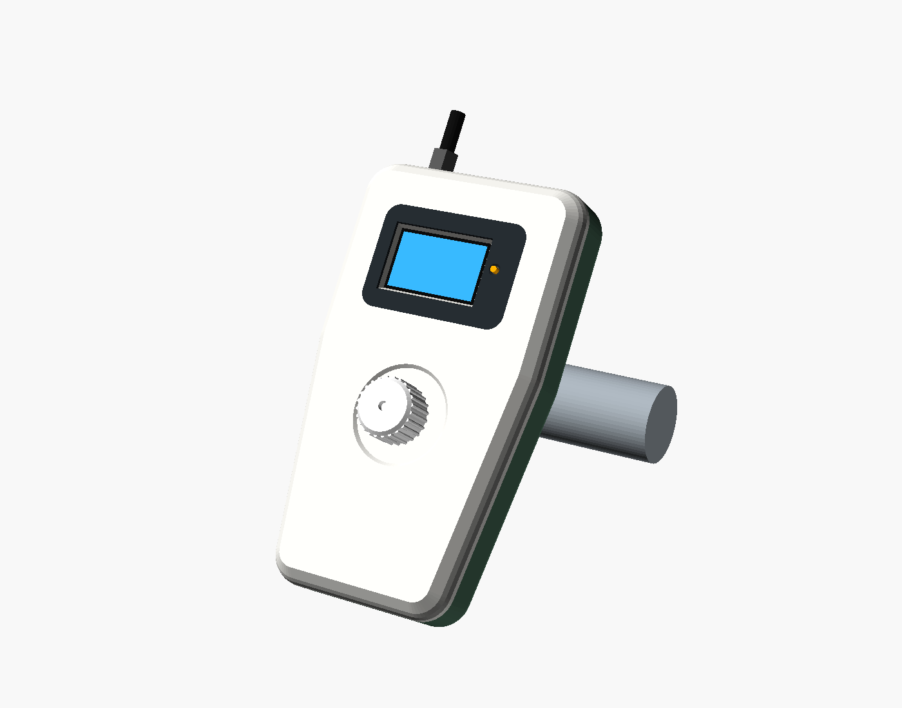 | 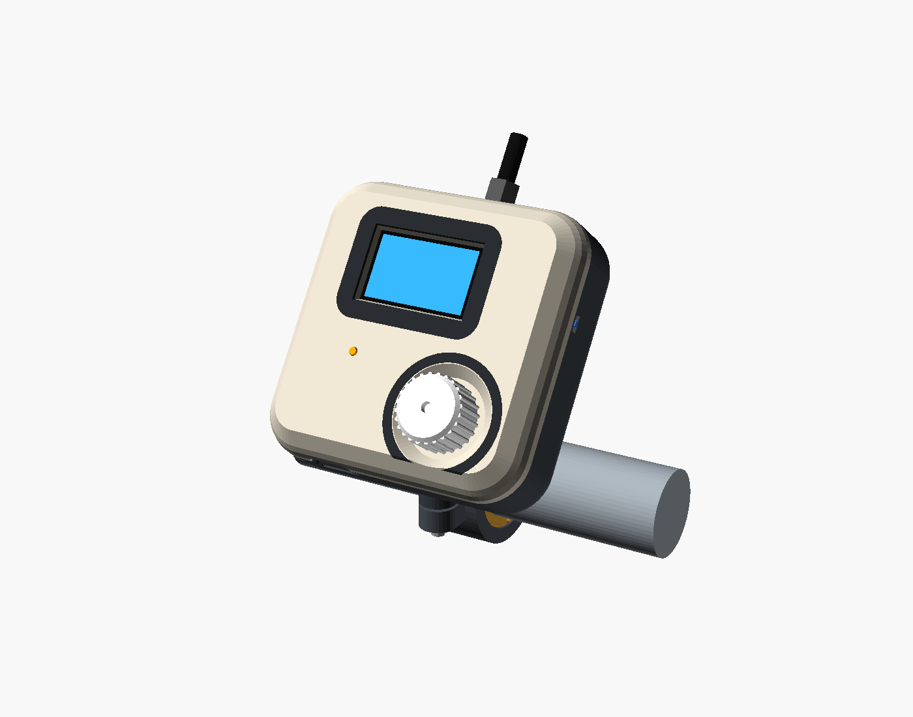 | 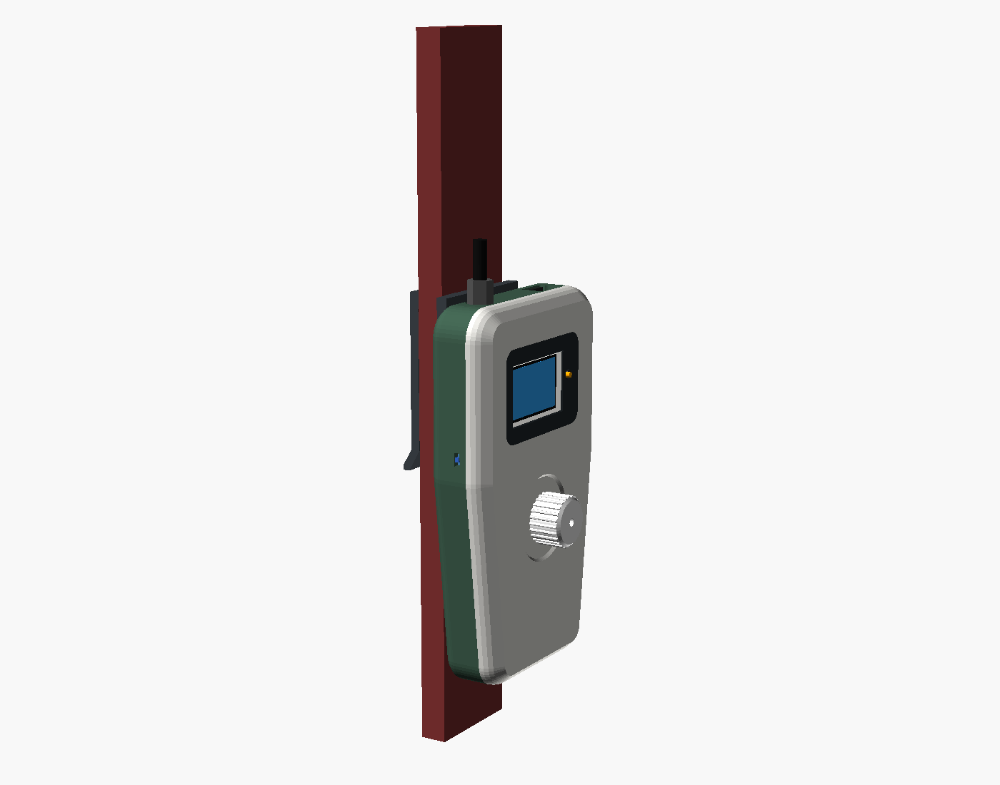 | 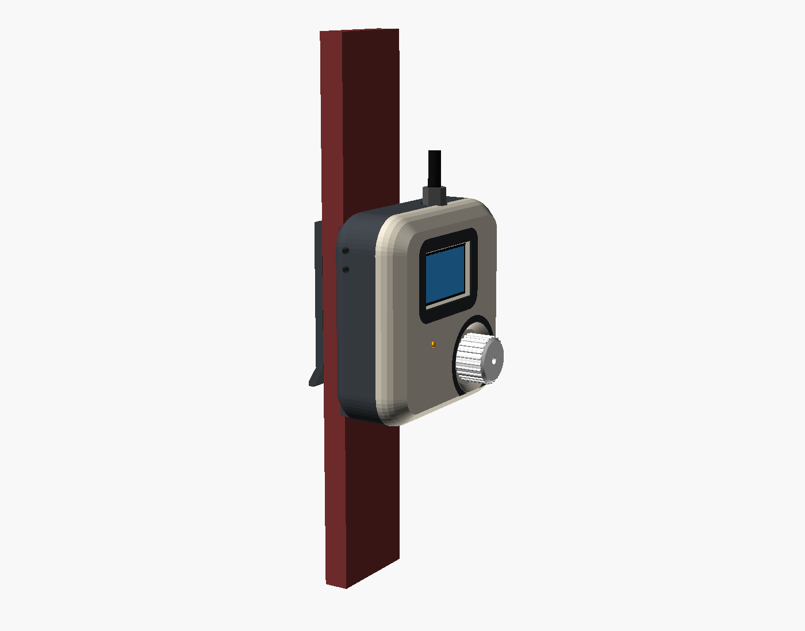 |

Side views: [A on the cart](renders/a_grip_cart_side.png), [B on the cart](renders/b_stone_cart_side.png).

**Printing, all PETG, no supports:**
- **Puck:** lugs down. The flange needs a 45° underside chamfer, which isn't modelled.
- **Clamp halves:** split face down, so the knuckle prongs stand vertical.
- **Tilt head:** prongs down.
- **Strap clip:** on its side, because its U-profile is a plain extrusion.
- **Shims:** TPU.

**Honest caveats:**
- **The strap clip's spring tongue may relax.** PETG creeps under constant load, especially in a hot car. The hook-and-loop slots are the backup.
- **Garmin compatibility isn't verified.** The device-female, mount-male convention is the same as Garmin's bike-computer mounts, but I didn't check these sizes against a real Garmin mount. Matching them would let you use cheap off-the-shelf Garmin-style bar mounts.

---

## Comparison

| | v0.1 | **A Grip** | **B Stone** | **B2 Stone, layered** |
|---|---|---|---|
| Outer size (mm) | 74.4 x 78 x 31.6 | 78.6 (62.6 at the handle) x 138.3 x 22.8 (+3.5 pad) | 79.4 x 80.4 x 29.6 | 63.0 x 75.5 x 34.8 |
| Envelope | ~175 cm³ | ~223 cm³ | ~177 cm³ | ~152 cm³ |
| Internal layout | Stacked (plate over the pouch, Twist over the boards) | Two zones, side by side | Stacked, Twist beside the GPS | 4 layers; GPS + OLED and Twist share layer 3 |
| One-handed use | Box held flat, dial centred | **Best:** remote-style grip, thumb dial, screen never covered | Good: palm stone, right-thumb dial | Good: smaller palm stone, right-thumb dial, leaning sides |
| Mounted | None (flat back) | Good: socket in the head, handle hangs | **Best:** compact and centred | **Best:** smallest face area |
| Pocketability | OK | Jacket pocket only | Good (no corners, knob in a cup) | Good: smallest footprint, but the deepest |
| Supports needed (X2D, PETG) | None | None | None | None (35° flanks, 44.7° at the bottom corners) |
| Parts | Shell, lid, plate, knob, plunger | Shell, lid, knob, plunger, TPU pad (no plate) | Shell, lid, plate, knob, plunger | Same as B |
| Layout risk | Proven | Medium (new layout, plug keep-out and cable lengths to verify) | **Low** (v0.1 stack) | Medium (Twist overhangs the Thing Plus, GPS on 3 posts, cables fold between layers) |
| Fit check (no parts through the shell) | ✓ | ✓ | ✓ | ✓, plus a component-to-component check |

## Recommendation

**Go with Concept A, the Grip, plus the TwistLock kit.**

You asked for a better handheld that also works mounted, and the Grip is the only one that changes how the device feels in the hand. You hold it one-handed with your thumb on the dial, and the screen stays clear above your hand. It's also the thinnest. The extra length is the price, and the mount handles it fine.

**Before committing,** print just the outer body of A as a quick, low-quality draft (or the shell and lid with no internals) to judge the length in your hand. Then measure the Thing Plus JST and Qwiic positions and check the Qwiic cable lengths. Those are the only things that could force a re-layout.

**If 138 mm feels too long,** B is the safe fallback. It reuses v0.1's internal stack (the least risk) and still fixes the "basic box" look, the knob, and the mount.

**Update:** you chose B. Its layered iteration, B2, is described above.

## Ideas I considered and dropped

- **Slim landscape slab (everything in one layer).** The Twist stack sets a depth of about 22 mm whenever the dial sits over a board or the pouch. Getting thinner would mean giving the Twist its own floor area, which makes the slab about 158 mm wide. A already captures most of the "slimmer" benefit.
- **Angled screen.** The screen sits above the dial, so tilting it toward your eyes means making the top end thicker, about 6 mm for every 10°. The cart mount's tilt knuckle gives the angle where it matters most. In the hand, your wrist does it for free.
- **Rotating bezel or side thumbwheel.** The Qwiic Twist is a shaft encoder with an axial push switch. A bezel or thumbwheel would need gears and would lose the click.
- **Round puck.** The pouch's diagonal (85 mm) forces a diameter of about 95 mm or more.
- **Smaller battery.** It wouldn't shrink B, because the side-by-side boards set B's width. For A, a 1.2 Ah 34 x 62 pouch could narrow the handle to about 42 mm. That's unverified and roughly halves the runtime, so I left it out.

## Files

| File | What it is |
|---|---|
| `concept_a_grip.scad` | Concept A. `part` = `assembly`, `exploded`, `cutaway`, `cart`, `strap`, `outer`, or the checks `chk`, `chk_out`, `chk_pad`, `chk_cart`. |
| `concept_b_stone.scad` | Concept B. `part` = `assembly`, `exploded`, `cutaway`, `cart`, `strap`, or the checks `chk`, `chk_out`, `chk_plate`, `chk_cart`. |
| `concept_b2_stone.scad` | Concept B2, print-ready. Views: `assembly`, `exploded`, `cutaway`, `side`, `cart`, `strap`. Print parts: `back_shell`, `lid`, `plate`, `knob`, `plunger`. Checks: `chk`, `chk_out`, `chk_comp`, `chk_plate`, `chk_pilot`, `chk_cart`. |
| `export_b2.sh` | Exports B2's print parts to `stl_b2/`. |
| `stl_b2/` | B2 print STLs, in print orientation. |
| `mount_kit.scad` | The TwistLock kit (`part="kit"`) and the socket and puck engagement detail (`part="socket"`). |
| `lineup.scad` | To-scale lineups: `part="all"` is v0.1, A and B; `part="b2"` is v0.1, B and B2. It uses `../cad/shot_tracker_case.scad` read-only. |
| `lib/components.scad` | Component sizes and ghost models, copied from v0.1. |
| `lib/shape.scad` | Rounded-body helper (`pebble`, with the exact inset used for the cavity), window, and strap-hole cuts. B2 builds its lens body from the same `corner_ring` pieces. |
| `lib/mount.scad` | Socket cutter, puck, bar clamp, shims, tilt head, strap clip. |
| `render_all.sh` | Regenerates everything in `renders/`. |

**Fit check:** for example, `openscad -D 'part="chk"' -o chk.stl concept_a_grip.scad`. It should come back empty or zero-volume. `chk_out` should be empty.
